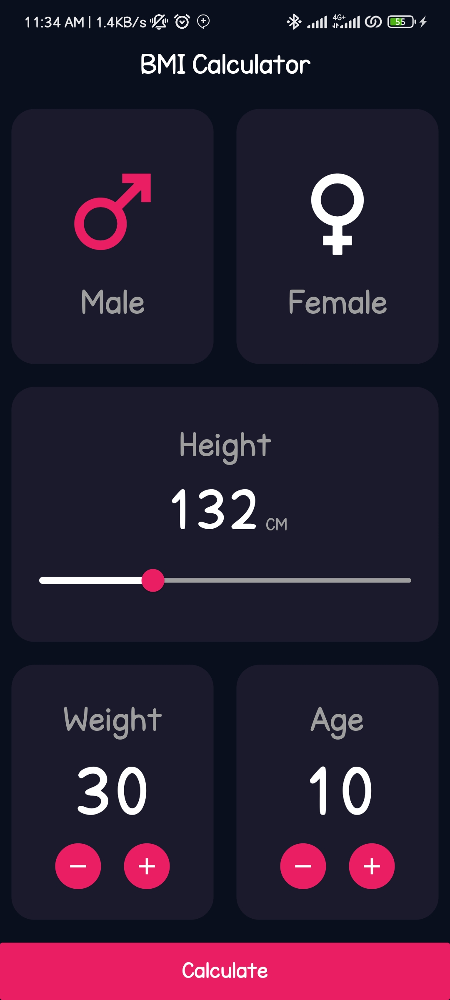

# 📱 BMI Calculator

A **simple** and **intuitive** Body Mass Index (BMI) calculator app built with **Flutter**. 

## ✨ Features

✅ **Calculate BMI** based on height and weight  
✅ **Categorize BMI** (Underweight, Normal, Overweight, Obese)  
✅ **User-friendly UI** for smooth experience  
✅ **Lightweight & Fast** with minimal dependencies  

## 📸 Screenshots

| Home Screen | Result Screen |
|-------------|--------------|
|  |  |

## 🚀 Getting Started

### 📥 Installation

1. **Clone the Repository**  
   ```sh
   git clone https://github.com/Akuma-0/BMICalculator.git
   ```
2. **Navigate to the Project Directory**  
   ```sh
   cd BMICalculator
   ```
3. **Install Dependencies**  
   ```sh
   flutter pub get
   ```

### ▶️ Running the App

1. **Connect a device** or start an emulator.
2. Run the app with:  
   ```sh
   flutter run
   ```

## 🛠 Tech Stack

- **Flutter** (UI Framework)
- **Dart** (Programming Language)

## 🤖 How It Works

1. Enter **height** and **weight**.
2. Tap the **Calculate** button.
3. View your **BMI Score** and category.

## 🤝 Contributing

Contributions are **welcome**! If you’d like to contribute:

1. **Fork** the repo.
2. **Create a new branch** (`git checkout -b feature-branch`).
3. **Make changes** and commit (`git commit -m 'Add new feature'`).
4. **Push to your branch** (`git push origin feature-branch`).
5. **Open a Pull Request**.


---

🌟 **Enjoy using the BMI Calculator! If you like it, give it a ⭐ on GitHub!**

